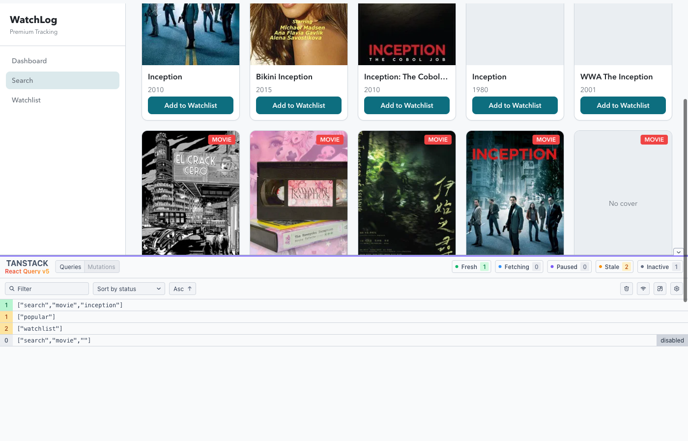

# Stage 6 — Zustand + TanStack Query

**Branch:** `stage-6`  
**Goal:** Split UI-only state from server/async state. Use Zustand for UI, TanStack Query for server data.

This file is the **documented split** the brief asks for. Later steps must follow this table. Do not put watchlist or search results into Zustand.

## Step 1 — Identify the two kinds of memory (done)

UI-only = what the screen remembers (filters, typed search, theme).  
Server/async = what came from elsewhere (APIs or persisted watchlist).  
Ephemeral = short-lived component memory (dialog open, login error). Leave as `useState`.

| Piece | Where it lives | Bucket | Tool |
|-------|----------------|--------|------|
| List filters (`type`, `status`) | `uiStore` (`listType`, `listStatus`) | UI | Zustand |
| Search box text + movie/book | `uiStore` (`searchQuery`, `searchType`) | UI | Zustand |
| Theme light/dark | `uiStore` (`theme`) | UI | Zustand |
| Popular titles | `usePopular` | Server | TanStack Query |
| Watchlist items | `useWatchlistQuery` + fake `watchlistApi` | Server | TanStack Query |
| Search results, loading, error | `useTitleSearch` | Server | TanStack Query |
| Login session | `AuthContext` | Leave | Keep Context |
| Delete dialog open | `ConfirmDeleteDialog` `useState` | Ephemeral | Keep `useState` |
| Login form error | `LoginPage` `useState` | Ephemeral | Keep `useState` |

**Rule:** if two pages should share the same cached fetch, it is Query. If it is a filter or theme, it is Zustand. If it dies when the widget unmounts and never hits an API, it can stay local.

## Step 2 — Zustand for UI-only state (done)

- **Store** — `src/store/uiStore.ts` (`useUiStore`)
- **Wired** — `ListPage` filters, `SearchBar` query/type, `ThemeToggle`
- **Removed** — `ThemeContext` / `ThemeProvider`

## Step 3 — TanStack Query for server/async state (done)

- **Provider** — `QueryClientProvider` in `App.tsx` (`src/query/queryClient.ts`)
- **Keys** — `src/query/keys.ts` (`watchlist`, `popular`, `search`)
- **Search / popular / watchlist** — Query hooks, not sagas or `useEffect` fetches
- **Removed** — Redux Toolkit, redux-saga

## Step 4 — Optimistic rating (done)

- `onMutate` writes the new rating into the cache first
- Fake API throws when **Simulate server failure** is checked
- `onError` restores the snapshot (stars snap back)

## Step 5 — Query Devtools + cache lifecycle (done)

- **Package** — `@tanstack/react-query-devtools` (dev only, bottom-left panel)
- **How to re-take it:** `npm run dev` → log in → `/add` → search a title → look at the panel

What the panel should show:

| Status | Meaning |
|--------|---------|
| **fresh** | Inside `staleTime` (30s) — cache is trusted, no refetch yet |
| **stale** | Older than 30s — next mount or window focus may refetch |
| **fetching** | A request is in flight |
| **inactive** | Cached, but no mounted subscriber |

Queries you should see: `['watchlist']`, `['popular']`, and after search `['search', 'movie', 'inception']` (or whatever you typed).

## Checkpoint

Stage 6 assignment pieces: documented split, optimistic rating, Devtools evidence. Submit from branch `stage-6`.
